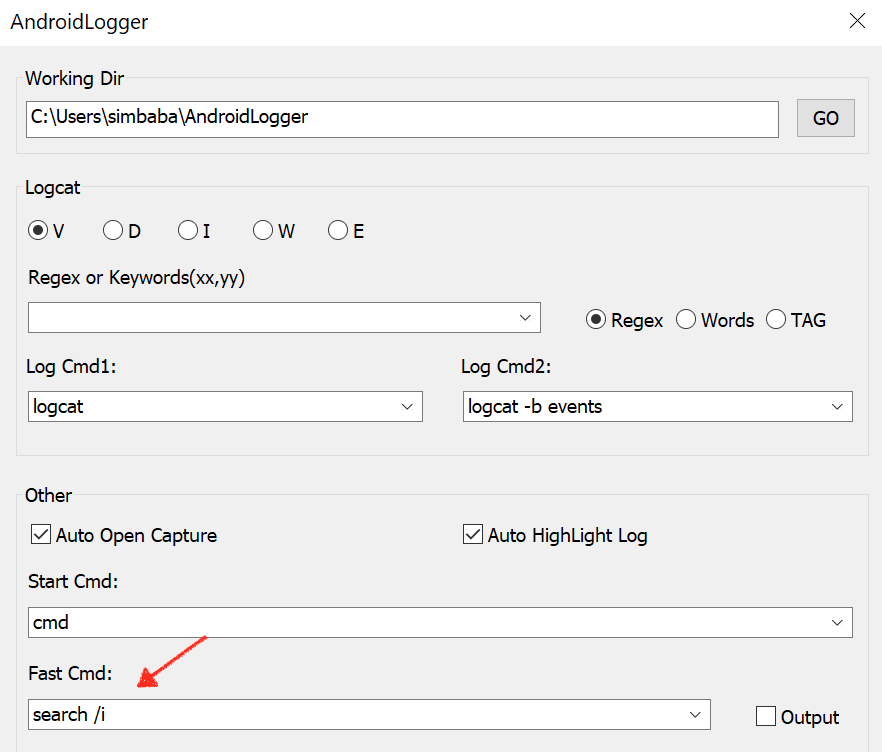
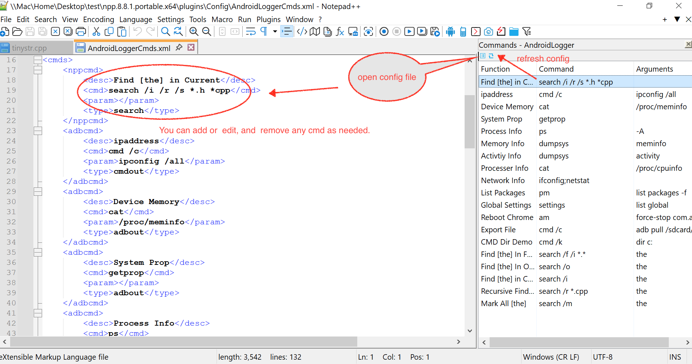
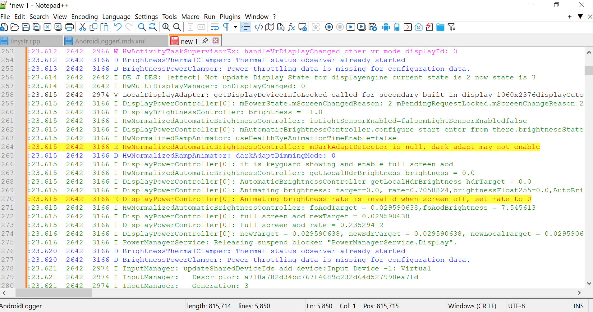
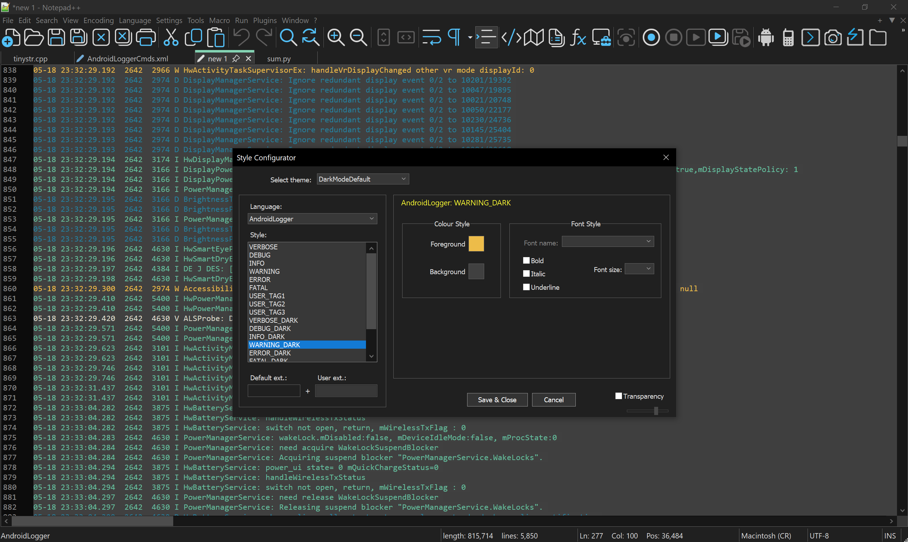

# AndroidLogger

## Introduction
AndroidLogger initially designed as an logcat lexer plugin of Notepad++, has evolved into a comprehensive toolkit with magic functionalities.
Even if you are not an Android developer, it is very useful for you！

Currently it supports 7.8.x ~ latest version of Notepad++. 
With the plugin, you can quickly run cmd and get the output to NPP, and you can search files by oneclick!

NOTE: It is recommended that you upgrade to a newer Npp version, taking 7.x as an example, the plugin toolbar is not displayed.

# Usage
## 1. Quick Search

Select text, then click the **[fast cmd]** to fire search quickly!

**1.1 Supports several options to fire search depend on your use.**
```
/i : ignore case
/o : search opend files
/f : search folder
/r : recursive search folder and sub-folders
/s : detect src folder then search recursively
/m : mark word highlight
/w : match word not use regex
```


**1.2 You can config search at [Settings] & [Common Cmds]**

> Method1, config at settings


> Method2, config at common cmds



## 2. Execute CMD
The [Common Cmds] support kinds of functions.

**2.1 adbcmd: adb, adbout**
```xml
<adbcmd>
    <desc>run adb shell getprop and out to NPP</desc>
    <cmd>getprop</cmd>
    <param></param>
    <type>adbout</type>
</adbcmd>
```
**2.1 oscmd: cmd, cmdout**

The cmdout provided a <ansi> option to convert cmdout to local encoding.

```xml
<oscmd>
    <desc>Python Run</desc>
    <cmd>python</cmd>
    <param>@!</param>
    <type>cmdout</type>
    <charset>ansi</charset>
</oscmd>
<oscmd>
    <desc>start calculator</desc>
    <cmd>calc</cmd>
    <param></param>
    <type>cmd</type>
</oscmd>
<oscmd>
    <desc>start logcat and out to NPP</desc>
    <cmd>cmd /c</cmd>
    <param>adb logcat</param>
    <type>cmdout</type>
</oscmd>
<oscmd>
    <desc>Dir Demo</desc>
    <cmd>cmd /k</cmd>
    <param>dir c:\</param>
    <type>cmd</type>
</oscmd>
```
**2.3 nppcmd: search**
```xml
<nppcmd>
    <desc>Find [the] in Current</desc>
    <cmd>search /i /r /s *.h *cpp</cmd>
    <param></param>
    <type>search</type>
</nppcmd>
```

# 3. Logcat Lexer
Essentially, it's a lexer for Android Logcat, you can custom color through NPP (Notepad++) preferences.




# 4. Android Tools
Supports capture screenshot and logs with filters.


**Install**
1. Push AndroidLogger.dll under "plugins" directory of Notepad++
2. Push AndroidLogger.xml under "plugins\Config" directory of Notepad++

**Features**
1. Support lexer fot APP & RADIO Log, and cutomizable
2. Support catching log on device: APP, RADIO
3. Support Shell CMD on device. 
->(1) The shell cmd line must start with '>' and at the top of doc.
->(2) Start with '#' is comment
->(3) Empty line is permitted
->(4) Freely use logcat, top & grep, tcpdump
4. Support capture device screenshot, now just save at d:\device.bmp

# 5. Update History
v1.4.3.4
> New icons to adapte fluent theme! Support [cmdout] with charset option.
> You can run python and cmds, and capture out to NPP. 
1. update icons
2. optimize cmdout
3. update search mark
4. support search in fast cmd!

v1.4.2.8
>A Powerful Search Feature Now Available in Common Cmds!
1. Search action style:  search /i /r /w /m /f /o 
2. Current File - default
3. Opened Files - /o
4. Current Directory - /f 
5. Update AndroidLogger settings to xml format!
6. Fix Unixtime Convert Crash issue
7. Update AndroidLogger settings to xml format!
8. Goodbye to copy config the xml file, now can generate it!


### v1.2.0
1) Support custom keyword, your keywords your color!
2) auto lexer for shell logcat cmd
3) optimization adb shell output efficiencily!

### v1.2.1
1) Fix lexer to compatible with leading or trailing spaces!


### v1.1.2
1) Fix when open style dialog, the fold margin is shown, should hide it!

### v1.1.1
1) Fix rgb issue, now device screenshot is ok!
2) Log & Shell concurrent optimization!

### 1.1.0
1) adb cmd will not timeout!
2) thread concurrent optimization

